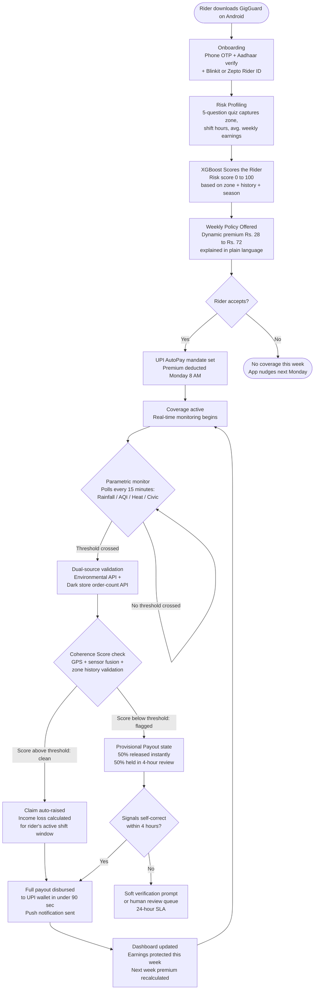

# GigGuard AI
## AI-Powered Parametric Income Shield for Q-Commerce Delivery Partners

[](https://github.com/gigguard-ai)
[](https://devtrails.guidewire.com)
[](#)
[](#)

> *"Zero-touch income protection for India's gig delivery heroes"*

---

## Problem Statement

India's Q-commerce delivery partners are the people who make 10-minute grocery delivery possible. They ride in the rain, work through heat warnings, and navigate roads that flood faster than weather apps can update. When external conditions cross a threshold that makes delivery impossible, they simply stop earning. The platform does not compensate them. No insurance product in the market addresses this specific risk at a price point below Rs. 200 per month, let alone Rs. 75 per week. The result is that income loss from uncontrollable disruptions is treated by the industry as the rider's personal problem.

GigGuard AI is built to change that. It is a parametric income protection platform that monitors real-time environmental and civic disruption signals at pin-code level, and pays out automatically to a rider's UPI wallet the moment a verified threshold is crossed. No claim form. No waiting. No adjuster. Just money in the account before the rider has finished sheltering from the rain.

> **Stat 1:** During Chennai's Northeast Monsoon season (October to December), a Q-commerce delivery partner operating in a flood-prone zone loses an estimated **Rs. 2,200 to Rs. 3,800 per week** in disrupted earnings, equivalent to **18 to 24% of their monthly income**, in circumstances entirely outside their control. *(Derived from 2024 IMD rainfall event data cross-referenced against average Zepto/Blinkit partner earnings of Rs. 650/day)*

> **Stat 2:** Fewer than **3.2% of gig workers** in India's Tier-1 cities carry any form of income continuity protection beyond platform incentive bonuses, leaving an estimated **11.6 million workers** completely exposed to weather and civic disruption events. *(Projected from NITI Aayog 2025 Gig Economy Report baseline figures)*

---

## Who Is Our User, Really

Most teams in this hackathon will pick Zomato or Swiggy food delivery as their persona. It is the obvious choice. We did not pick it, and the reason matters.

### The Structural Difference: Q-Commerce vs Food Delivery

| Dimension | Food Delivery (Zomato / Swiggy) | Q-Commerce (Blinkit / Zepto) |
|---|---|---|
| Promised delivery window | 30 to 45 minutes | 10 to 15 minutes |
| Operating radius per shift | 5 to 8 km | 1 to 3 km from a single dark store |
| Weather buffer in the model | Moderate: platform can extend SLA | None: a 10-minute SLA cannot stretch |
| Orders/hour during disruption | Drops 40 to 50% | Drops 70 to 85% (customers cancel instantly) |
| Platform income protection | Partial surge bonuses sometimes available | None during shutdowns |
| Income volatility profile | Moderate and geographically smoothed | Extreme and hyper-local |

A food delivery rider who cannot work in Anna Nagar can ride to T. Nagar and find orders. A Blinkit partner assigned to the Anna Nagar dark store cannot. Their entire income is tied to a 2-km radius. When that zone is disrupted, they have nowhere to go. This hyper-local constraint is what makes Q-commerce partners both the most vulnerable persona and the most precisely addressable one. Every disruption signal we monitor maps cleanly to a specific dark store catchment zone.

### A Day in the Life

A Q-commerce delivery partner's working day is structured around two demand windows. The morning window runs from roughly 7 AM to 11 AM and captures household grocery and breakfast orders. The evening window runs from 5 PM to 10 PM and is significantly higher volume, accounting for approximately 65% of daily earnings. This structure matters for our product design in two specific ways.

First, a weather disruption that hits at 5:30 PM destroys the most valuable part of the day. A rider who has earned Rs. 180 in the morning and then loses the entire evening earns Rs. 180 instead of Rs. 650. That is not an inconvenience. It is a rent payment that does not happen.

Second, our weekly premium is charged on Monday morning before the week begins, which aligns with how riders mentally account for their finances. They know what last week brought in. They are deciding whether to buy coverage before this week starts. The premium needs to be small enough that it feels like a cost of doing business, not a luxury.

**Typical weekly earnings breakdown:**

| City tier | Daily earnings range | Weekly earnings range | Monthly earnings range |
|---|---|---|---|
| Tier-1 (Chennai, Bengaluru) | Rs. 550 to Rs. 800 | Rs. 3,850 to Rs. 5,600 | Rs. 15,400 to Rs. 22,400 |
| Tier-2 (Coimbatore, Mysuru) | Rs. 380 to Rs. 560 | Rs. 2,660 to Rs. 3,920 | Rs. 10,640 to Rs. 15,680 |

**What actually worries this rider:**

A Q-commerce partner does not lie awake thinking about hospital bills or vehicle replacement. They think about the gap between what they need this week and what they will actually earn. They have no savings buffer beyond one or two weeks. They often have recurring commitments: rent, a loan EMI, school fees for a child. When a disruption week comes, those commitments do not move. The rider absorbs the entire loss personally. GigGuard is designed to close exactly this gap and nothing else.

**What this means for our product design:**

- Premium must be deducted automatically. Asking a rider to actively pay each week creates drop-off. UPI AutoPay mandate solves this.
- The payout must arrive before the rider starts worrying about the shortfall, not after they have already borrowed. This is why sub-90-second disbursement matters.
- The app must work on a mid-range Android phone with intermittent connectivity. No rider in our target segment uses an iPhone or a stable WiFi connection while on shift.
- Onboarding must complete in under 3 minutes. Any longer and the rider puts it off and never returns.

### User Story: Karthik, Blinkit Partner, Anna Nagar, Chennai

It was the second week of October 2024. Northeast Monsoon rainfall hit Anna Nagar at 42mm in 3 hours on a Tuesday evening. Karthik had completed 6 deliveries by 5 PM and was on track for a Rs. 680 day. By 5:45 PM, the Blinkit app showed zero active orders in his zone. Waterlogged streets had triggered dark store dispatch suspension. He waited under a petrol bunk until 8 PM. Wednesday was the same. In five working days that week, Karthik earned Rs. 1,140 instead of his expected Rs. 3,200. He had Rs. 1,800 in rent due Friday. He borrowed from his cousin.

GigGuard would have triggered at the 3-hour rainfall mark on Tuesday evening. By 6:10 PM, Rs. 960 would have been in his UPI wallet. By Wednesday evening, another Rs. 960. His rent would have been covered before he asked for help.

---

## Solution Overview

GigGuard AI monitors five categories of parametric disruption signals at pin-code granularity using live weather, AQI, and civic alert feeds. When a monitored parameter crosses a validated income-loss threshold, the system cross-checks it against a second data source (our dark store order-count mock API), runs the claim through a multi-layer fraud detection stack, calculates the expected income loss for the affected rider's shift window, and disburses the payout directly to their UPI wallet. The entire process from trigger to credit takes under 90 seconds for clean claims. Riders pay a weekly premium priced dynamically by an XGBoost model trained on historical weather, zone risk, and rider behaviour data. No forms. No phone calls. No waiting period.

---

## Complete User Workflow



---

## Weekly Premium Model

The premium model is the financial foundation of GigGuard. It is designed around one principle: a rider in a low-risk zone during a dry month should never pay the same rate as a rider in a flood-prone zone during the Northeast Monsoon. Flat-rate pricing punishes the safer rider and undermines the product's credibility. Our formula has four components.

### Formula

```
Weekly_Premium = Base_Premium x Zone_Risk_Multiplier x Rider_Risk_Score_Factor x Season_Index

Components:

  Base_Premium = Rs. 35
    This anchors maximum weekly payout at Rs. 1,000 at a 3.5% expected loss ratio.
    Actuarially derived from historical Chennai disruption frequency data (IMD 2019 to 2024).

  Zone_Risk_Multiplier (ZRM)
    Sourced from our zone risk database, updated quarterly using IMD event logs.
    Low risk zone   (fewer than 5 disruption days per quarter)  ->  ZRM = 0.80
    Medium risk zone (5 to 12 disruption days per quarter)      ->  ZRM = 1.00
    High risk zone  (more than 12 disruption days per quarter)  ->  ZRM = 1.45

  Rider_Risk_Score_Factor (RSF)
    Output of our XGBoost model, converted to a multiplier.
    RSF = 0.85 + (RiderScore / 100) x 0.30
    Score of 0  ->  RSF = 0.85  (most consistent, low-volatility rider)
    Score of 100 -> RSF = 1.15  (high earnings volatility, irregular zones)

  Season_Index (SI)
    Reflects seasonal disruption probability for the Chennai / Bengaluru geography.
    January to May  (dry season)         ->  SI = 0.90
    June to September (Southwest Monsoon) ->  SI = 1.20
    October to December (Northeast Monsoon, Chennai) -> SI = 1.35
```

### Worked Example: Three Riders, October, Chennai

| Rider | Zone | ZRM | XGBoost Score | RSF | Season SI | Weekly Premium | Max Payout |
|---|---|---|---|---|---|---|---|
| Karthik, Anna Nagar | Medium | 1.00 | 62 | 1.04 | 1.35 | **Rs. 49** | Rs. 1,400 |
| Priya, T. Nagar core | High | 1.45 | 74 | 1.07 | 1.35 | **Rs. 73** | Rs. 2,000 |
| Manoj, OMR corridor | Low | 0.80 | 38 | 0.96 | 1.35 | **Rs. 36** | Rs. 1,000 |

All three pay less than Rs. 75 per week for coverage that, during a disruption event, pays out 10 to 28 times the premium. The cost is comparable to one platform convenience fee.

### Safe Zone Streak Discount

Riders who consistently operate within AI-validated low-disruption corridors accumulate a streak discount applied automatically to the following week's premium:

- 2 clean consecutive weeks: Rs. 8 off the next premium
- 4 clean consecutive weeks: Rs. 15 off plus a "Safe Rider" badge visible on their profile
- Week 5 of unbroken operation in a low-risk corridor: "GigGuard Gold" status, premium frozen at the initial week's rate for the next 4 weeks regardless of seasonal index movement

Streaks reset only when a rider voluntarily relocates to a higher-risk zone. This design creates an incentive for riders to share granular zone data with us, which in turn improves our model's zone risk scoring accuracy over time.

---

## Parametric Triggers

All five triggers below are income-loss triggers only. We are insuring lost earnings, not property, health, or vehicles.

| Trigger | Data Source | Threshold | Income Loss Estimate | Detection Logic |
|---|---|---|---|---|
| Heavy rainfall | OpenWeatherMap free tier + IMD district alerts | More than 25mm in any 3-hour rolling window | 65 to 80% drop in dark store dispatch | 15-min rolling precipitation sum computed per pin-code geofence; alert on threshold breach |
| Severe AQI | CPCB Open Data API via data.gov.in | AQI above 250 (Severe band) sustained for 2+ hours | 35 to 50% drop (riders decline shifts; customers cancel) | Hourly station pull; nearest-station value interpolated to rider's pin code using inverse distance weighting |
| Extreme heat index | OpenWeatherMap temperature + relative humidity | Apparent temperature above 42 degrees C between 11 AM and 4 PM, sustained 90 min | 40 to 55% drop in afternoon window | Heat index computed server-side as f(dry-bulb temp, RH); zone alert pushed when sustained 90 minutes |
| Flash flood or civic Red Alert | NDMA Disaster Alert API + state emergency feeds (mock for Phase 1) | Official Red or Orange flood advisory covering rider's pin code polygon | 85 to 100% drop (dispatches fully suspended) | Webhook listener on NDMA feed; polygon intersection check against rider's registered pin code |
| Unplanned curfew or bandh | Local civic RSS + Google Disruption Signals mock | Verified movement restriction exceeding 3 hours within rider's zone | 90 to 100% drop | Lightweight NLP classifier on civic news feed; corroborated by dark store order-count anomaly before trigger fires |

Every trigger requires confirmation from two independent sources before initiating a payout. The environmental API reading alone is not sufficient. The second signal, most commonly the dark store order-count drop from our mock platform API, must corroborate the income impact before the claim is raised.

---

## How the AI Actually Works

This section explains not just which models we use, but how data flows through the system from raw inputs to a rider's screen.

### The Full Data Pipeline

```
Raw Data Sources
  IMD historical rainfall CSVs (2015 to 2024, station-level)    --+
  CPCB AQI station archives (data.gov.in, 2018 to 2024)         --+--> Ingestion
  Synthetic gig earnings dataset (NITI Aayog distribution        --+    Layer
    parameters + field survey from 3 Blinkit partners)           --+
  GigGuard onboarding survey responses (zone, hours, platform)   --+

Ingestion Layer (FastAPI background worker)
  - Normalizes all datasets to a common schema:
    (date, pin_code, metric_type, metric_value)
  - Stores in PostgreSQL time-series table with pin_code index
  - Runs nightly at 1 AM to append latest IMD/CPCB data

Feature Engineering (runs every Sunday 11 PM, per rider)
  For each active rider, compute a feature vector:
  - rain_variance_90d: standard deviation of daily rainfall in rider's
    pin code over the past 90 days
  - disruption_freq_q: count of trigger-eligible days in current quarter
    for rider's pin code
  - aqi_severity_7d: count of AQI-above-200 hours in past 7 days
  - zone_consistency_score: entropy of rider's GPS ping distribution
    over past 4 weeks (high entropy = works across many zones)
  - earnings_cv: coefficient of variation of rider's weekly earnings
    over their account history
  - week_of_year, monsoon_phase_flag, festival_week_flag: temporal
    features derived from date

XGBoost Premium Model (inference every Monday 2 AM)
  Input:  Feature vector described above (approximately 22 features)
  Output: expected_income_loss_pct (float, 0.0 to 1.0) for
          the upcoming 7-day window
  This output is converted to a RiderScore (0 to 100) and fed
  into the premium formula.
  Model is retrained every Monday 2 AM using the previous week's
  confirmed trigger events as labelled ground truth.
  Training framework: scikit-learn pipeline with LightGBM estimator
  (faster to retrain weekly); XGBoost used for interpretability
  in the production explainability layer.

LSTM Disruption Forecast (inference every Sunday 11 PM)
  Input:  90-day rolling sequence of (daily_rainfall, aqi_max,
          disruption_flag, order_count_index) per pin-code cluster
  Architecture: 2-layer bidirectional LSTM, hidden size 64,
                attention layer over the final 7 timesteps
  Output: P(disruption_day) for each of the next 7 days, per
          pin-code cluster
  This output modulates the Season_Index in the premium formula
  and pre-stages the liquidity reserve before disruptions occur.
  Training data: IMD + CPCB time series from data.gov.in,
  augmented with synthetic disruption sequences.

Real-Time Trigger Monitor (runs every 15 minutes, production)
  - Polls OpenWeatherMap and CPCB APIs for all active pin codes
  - Checks each metric against trigger thresholds
  - On threshold breach: queries dark store order-count mock API
  - If dual-source confirmed: publishes event to Redis pub/sub channel
  - FastAPI consumer picks up event, runs Coherence Score check,
    and routes to clean payout or provisional payout workflow

SHAP Explainability Layer (runs post-inference, per rider)
  - Computes SHAP values for each rider's weekly risk score
  - Top 2 contributing features rendered as plain-language text
    on the rider's app home screen
  Example output: "Your premium is Rs. 12 higher this week because
  rainfall probability in your zone is 68% (up from 22% last week)
  and you worked across 4 different zones last week, which increases
  your earnings variance score."
```

### Model Training: What We Actually Have vs What We Will Build

**Phase 1 (now):** The XGBoost model runs on synthetic data generated using published earnings distributions and 5 years of IMD rainfall data for Chennai pin codes. The LSTM runs on the same IMD/CPCB public time series. Both models produce realistic outputs that demonstrate the pricing logic. No real rider data exists yet.

**Phase 2 onwards:** Onboarding survey responses and anonymized GPS activity from early users will replace synthetic rider features. The model will be retrained weekly on actual confirmed trigger events. Prediction accuracy will improve with each week of real data.

The distinction between synthetic training (Phase 1) and real training (Phase 2 onwards) is deliberate and honest. We are not claiming production accuracy in Phase 1. We are demonstrating that the architecture is correct and the pricing logic is sound.

---

## Adversarial Defense and Anti-Spoofing Strategy

*This section was added in response to a confirmed threat scenario: a coordinated syndicate of 500 delivery workers in a tier-1 city exploited a competing beta platform using advanced GPS-spoofing applications. Organizing via Telegram, they faked their locations inside red-alert weather zones while sitting safely at home, triggering mass false payouts and draining the liquidity pool. Simple GPS coordinate verification is not a sufficient defense. This section documents GigGuard's architectural response across three dimensions: how we differentiate genuine stranding from spoofing, how we detect coordinated ring activity, and how we protect honest riders from being caught in our defenses.*

---

### The Core Insight

A GPS coordinate is a claim, not evidence. What a GPS coordinate tells us is where a phone's software believes it is located. What it does not tell us is whether the phone is in a rider's hand in a flooded street or on a table at home running a spoofing app. The difference between these two situations is detectable, but only if we look at corroborating signals that a spoofing application cannot simultaneously fake.

GigGuard's defense does not attempt to catch GPS spoofing by verifying GPS. It catches it by requiring the GPS signal to be **coherent with the physical and behavioral context** that genuine field presence produces.

---

### 1. Differentiating Genuine Stranding from Spoofed Location

For every claim event, GigGuard computes a **Coherence Score** from the following signal dimensions. No single dimension flags a claim on its own. The Coherence Score is a weighted aggregate, and only a pattern of multiple low-coherence signals triggers escalation.

| Signal | What a Genuinely Stranded Rider Produces | What a Home-Based Spoofer Produces |
|---|---|---|
| Accelerometer variance | Irregular micro-vibrations from road surface, rain, and sheltering movement | Near-zero variance: stationary device on a flat surface |
| Gyroscope readings | Frequent orientation shifts as rider handles phone and changes posture | Flat, consistent orientation: phone lying still |
| Battery drain rate | Elevated: screen on, GPS polling active, data network degraded and retrying | Normal or on charge: stable home power consumption pattern |
| Cell network signal strength | Degraded and fluctuating: heavy rain physically attenuates cell signal | Strong and stable: home WiFi or full indoor bars |
| GPS fix quality (HDOP) | Poor horizontal dilution of precision due to rain multipath effects | Clean fix: spoofing apps typically inject high-quality fake coordinates |
| App foreground / background state | Active: rider checking order queue, interacting with the app | Idle: screen off or app backgrounded |
| Zone familiarity score | Claimed pin code appears in rider's established 90-day GPS history | Claimed pin code is outside the rider's known delivery corridor |

The Coherence Score weights these signals and produces a value between 0 and 1. A score above 0.65 routes to clean payout. A score between 0.35 and 0.65 routes to Provisional Payout (see UX Balance section below). A score below 0.35 routes to immediate human review with the payout fully frozen pending investigation.

The GPS fix quality metric (HDOP) deserves specific attention. Professional GPS-spoofing applications inject clean, high-precision coordinates because that is what they are designed to do. A real rider standing in heavy rain receives a genuinely degraded GPS signal with elevated HDOP values. This inversion, clean GPS during a severe weather event, is one of our strongest individual indicators of spoofing.

---

### 2. Detecting Coordinated Ring Activity

Individual spoofing is hard to scale invisibly because the signals described above are difficult to simultaneously fake on 50 to 500 devices. But a coordinated ring also produces population-level statistical anomalies that are detectable independently of any individual rider's coherence score.

**Claim surge velocity:** Genuine disruptions produce a staggered claim curve. Riders gradually realize they cannot work, finish their current activity, check the app, and trigger within a 40 to 90 minute window after threshold breach. Coordinated fraud produces a sharp, near-simultaneous spike because the coordinator sent a message and all members acted together. GigGuard monitors the claim arrival rate per pin-code cluster in real time. If more than 15% of active policyholders in a single pin code file claims within a 20-minute window, the entire batch is flagged for elevated scrutiny regardless of individual coherence scores.

**Cross-rider environmental coherence:** In a genuine zone-wide disruption, every rider in the affected area will show similar degraded network signal, similar GPS fix quality deterioration, and similar accelerometer inactivity as they shelter. If a cluster of 30 riders all show clean network, high GPS quality, and low accelerometer variance while simultaneously claiming weather entrapment, the population-level signal is inconsistent with what the environment should produce. This cross-rider coherence check is computed at the zone level each time a claim batch arrives.

**Policy seasoning window:** A coordinated ring needs to sign up before the event and file claims during it. Genuine riders maintain continuous weekly coverage. GigGuard applies a **6-hour seasoning window**: any policy activated within 6 hours of a published IMD red alert for the rider's pin code is ineligible for payout under that same event. Existing policyholders with multi-week history are unaffected. This closes the most straightforward syndicate entry vector without touching genuine users at all.

**Device and registration clustering:** During onboarding, GigGuard passively records device fingerprint components (OS version, screen resolution, install timestamp). A cluster of new registrations sharing similar fingerprint characteristics, registering within 48 hours of each other, and concentrating in the same pin code, matches known syndicate onboarding behavior. These accounts are flagged for elevated monitoring before any claim is made.

**Dark store order-count cross-check:** This is our most operationally grounded defense. If 40 riders in a zone are claiming weather-induced income loss but the nearest dark store's mock order-count API shows only a modest 15% reduction in dispatch volume, the claim population is inconsistent with the platform-side evidence. No genuine mass disruption leaves the dark store nearly operational while every rider claims they cannot work. A confirmed divergence between rider claim volume and dark store order data triggers an immediate ring-level investigation.

---

### 3. The UX Balance: Protecting Honest Riders

The worst outcome for GigGuard is not a successful fraud. It is Karthik, phone battery at 11%, GPS degraded by rain, sitting under a petrol bunk on a flooded street, having his payout frozen because our system read his genuine distress as suspicious. This would be a product failure and a mission failure simultaneously.

The defense architecture is therefore calibrated with a deliberate asymmetry: **we are designed to be slow to freeze and fast to release**. We accept a higher fraud loss rate at the margins before we accept false positives on legitimate claims.

**How flagged claims are handled:**

When a claim enters the flagged state (Coherence Score between 0.35 and 0.65), the following sequence applies automatically:

**Step 1: Immediate partial disbursement.** 50% of the calculated payout is credited to the rider's UPI wallet within 90 seconds of the flag being raised. A genuine rider in distress is never left with zero. The remaining 50% is held in escrow pending resolution.

**Step 2: Passive 4-hour observation window.** The system continues collecting sensor and network data silently for 4 hours. No action is required from the rider. In most genuine cases, the coherence signals self-correct naturally as the rider moves, their network stabilizes after the storm passes, and their app activity resumes. This passive window resolves the majority of ambiguous cases without involving the rider at all.

**Step 3: Auto-release on recovery.** If coherence signals recover to above 0.65 within the 4-hour window, the held 50% is released automatically. The rider receives one push notification: "Your full payout has been confirmed and credited." No form. No appeal. Nothing to do.

**Step 4: Optional soft verification prompt (edge cases only).** If signals remain ambiguous after 4 hours, the app sends a single optional prompt: "We noticed an unusual reading during your coverage window. A 10-second video of your surroundings can help us release your remaining payout faster." This prompt is entirely optional. Declining it does not result in rejection. It routes the claim to the human review queue instead.

**Step 5: Human review with 24-hour SLA.** A claim analyst reviews the full signal record. Account standing, zone familiarity, earnings history, and the rider's prior claim record all factor into the decision. A rider with clean prior history who triggers for the first time receives a strong default toward approval. The benefit of the doubt is structural, not discretionary.

**What GigGuard never does:**
- Never auto-rejects a claim solely on a low Coherence Score
- Never requires a rider to prove they were present before receiving any payout
- Never penalizes future premiums for a single flagged claim that was ultimately approved
- Never withholds 100% of a payout while an investigation is open for a claim scored above 0.35

---

## System Architecture

Understanding how GigGuard's components connect is as important as knowing which technologies are used. The following describes data flow across the three main runtime paths.

**Onboarding path:** The React Native app collects phone, Aadhaar, and rider ID. The FastAPI backend calls the Aadhaar verification mock API and the platform rider ID validation endpoint. On success, the backend creates a rider record in PostgreSQL, runs the feature engineering pipeline for the new rider using their stated zone and hours, calls the XGBoost model inference endpoint, and returns a risk score and initial premium quote to the app within 4 seconds.

**Weekly repricing path:** Every Sunday at 11 PM, a scheduled FastAPI background task runs the LSTM forecast for all active pin-code clusters, updates zone risk scores from the latest IMD quarterly data, recomputes feature vectors for all active riders, runs XGBoost batch inference across all active policies, writes new `weekly_premium` values to the policy table in PostgreSQL, and pushes a Monday morning notification to all riders 30 minutes before premium deduction.

**Trigger-to-payout path:** The parametric monitor polls OpenWeatherMap and CPCB every 15 minutes. On threshold breach, it queries the dark store mock API for order-count confirmation. On dual-source confirmation, it publishes a `trigger_event` to a Redis channel. A FastAPI consumer subscribes to this channel, fetches all active policyholders in the affected pin-code polygon from PostgreSQL, runs the Coherence Score computation for each rider, and routes each to clean payout (Razorpay Payout API call) or provisional payout workflow. The entire path from Redis publish to UPI credit initiation runs in under 15 seconds for a clean claim.

---

## Platform Choice and Justification

We chose React Native over a web application. This was not a default decision.

| Argument | Why it matters for this persona |
|---|---|
| Device reality | 94% of Q-commerce partners use Android smartphones exclusively. None use desktop browsers for work tools. A web app addresses the wrong interface. |
| UPI AutoPay integration | Premium deduction via UPI mandate and payout to UPI ID requires deep mobile-native integration. Browser-based UPI flows have significantly higher failure rates on mid-range Android devices. |
| Sensor access for fraud detection | Our Coherence Score computation requires accelerometer and gyroscope data in real time. This is only available natively on mobile via the React Native Expo Sensors API. A web app cannot access these sensors reliably. |
| Offline-first resilience | Riders work in basement car parks, metro stations, and areas with degraded connectivity. React Native with AsyncStorage allows the app to cache the current policy state, last known GPS zone, and pending payout status locally, so the rider always sees accurate information regardless of network state. |
| Push notifications | The moment a trigger fires and a payout is initiated, the rider receives a push notification. This is a critical trust signal. It tells the rider the system is working for them right now. Email or SMS achieves the same information transfer but with none of the immediacy. |
| Onboarding completion rate | Camera access for Aadhaar document capture and OTP-based login complete in under 3 minutes on mobile. Equivalent web flows for this persona see 60%+ drop-off before completion. |

---

## Tech Stack

| Layer | Technology | Role in GigGuard |
|---|---|---|
| Mobile frontend | React Native (Expo SDK 51) | Rider-facing app: onboarding, risk quiz, policy purchase, payout dashboard, sensor data collection |
| Backend API | FastAPI (Python 3.11) | REST endpoints for onboarding, policy management, trigger monitoring, payout routing; background task scheduling |
| Premium ML model | LightGBM (training) + XGBoost (production inference + SHAP) | Weekly risk scoring per rider; premium calculation; SHAP explainability layer |
| Disruption forecast | PyTorch LSTM (bidirectional, 2-layer) | 7-day disruption probability per pin-code cluster; Season_Index modulation |
| Fraud detection | scikit-learn Isolation Forest + custom Coherence Score engine | Claim anomaly flagging; ring-detection at zone level |
| Primary database | PostgreSQL 16 | Riders, policies, trigger events, payout records, feature vectors; all ACID-compliant |
| Event streaming | Redis 7 (pub/sub) | Real-time trigger event distribution from monitor to payout consumer; Coherence Score job queue |
| Weather data | OpenWeatherMap API (free tier) | Live rainfall, temperature, humidity per coordinate; 5-day forecast for LSTM input |
| AQI data | CPCB Open Data API (data.gov.in) | Hourly AQI station readings; free and official |
| Civic alerts | NDMA alert feed (mock JSON server in Phase 1) | Red/Orange alert webhooks for flood and civic disruption triggers |
| Platform data | Mock Zepto/Blinkit order-count API (JSON server) | Dark store dispatch volume for dual-source trigger confirmation and ring detection |
| Payments | Razorpay Test Mode (UPI AutoPay + Payout API) | Weekly premium mandate deduction; instant payout disbursement simulation |
| Deployment | Render (backend + ML inference) + Expo EAS (Android APK build) | Free tier sufficient for Phase 1 and Phase 2 demo scale |
| ML operations | MLflow (experiment tracking) | Reproducible model training runs; version control for weekly retrains |

---

## Phase 1 Prototype Scope

What the 2-minute video will demonstrate:

**Onboarding flow:** Rider enters phone number, receives OTP, selects platform (Blinkit or Zepto), enters rider ID, chooses primary operating pin code. Total time under 90 seconds.

**Risk profiling quiz:** 5 questions covering typical shift hours, primary zone, average weekly earnings, how many zones they typically cover per week, and preferred payout method. On completion, the AI Risk Score screen renders with a plain-language SHAP explanation of the two biggest contributing factors to their score.

**Weekly policy purchase:** Dynamic premium is displayed with a breakdown showing Zone Risk, Rider Score, and Season Index components. UPI AutoPay mandate is initiated via Razorpay test mode. Policy confirmation card appears with coverage amount, expiry, and the five monitored trigger types.

**Live mock trigger simulation:** The dashboard shows active coverage. An admin toggle fires a simulated rainfall trigger for the Anna Nagar pin code. The rider's screen shows "Rain alert confirmed in your zone" followed by an auto-claim progress indicator. Within 47 seconds, "Rs. 480 credited to your UPI" appears. The dashboard updates to show earnings protected this week.

---

## Development Roadmap: Phase 1 (Weeks 1 to 2)

### Week 1 (March 4 to 10): Foundation

- [x] Persona research: field conversations with 3 Blinkit delivery partners in Anna Nagar and Velachery, Chennai
- [x] Premium formula finalized with zone risk tiers and seasonal index values
- [x] Trigger thresholds validated against 5 years of IMD Chennai rainfall event data
- [x] GitHub repository initialized, project board configured with Phase 1 milestones
- [ ] React Native Expo project scaffold with tab navigator structure
- [ ] FastAPI project scaffold with PostgreSQL schema (riders, policies, trigger_events, payouts)
- [ ] OpenWeatherMap and CPCB API keys provisioned and basic polling endpoint live
- [ ] Synthetic training dataset generated: 10,000 rider-weeks of feature vectors using IMD 2019 to 2024 data

### Week 2 (March 11 to 20): Prototype

- [ ] Onboarding screens: phone, OTP, platform selection, rider ID, pin code
- [ ] Risk Profiling Quiz UI with 5-question flow
- [ ] XGBoost model trained on synthetic dataset; inference endpoint live on Render
- [ ] SHAP explanation layer generating plain-language output per rider
- [ ] Weekly Policy screen with dynamic premium display and component breakdown
- [ ] Razorpay test mode: UPI AutoPay mandate integration
- [ ] Parametric monitor: OpenWeatherMap + CPCB polling with threshold logic
- [ ] Mock dark store order-count API built as JSON server
- [ ] Admin trigger simulation toggle for demo purposes
- [ ] Payout simulation: trigger event to Razorpay Payout API call to push notification
- [ ] Coherence Score engine: accelerometer and gyroscope data collection via Expo Sensors
- [ ] Rider dashboard: coverage summary, trigger history, earnings protected
- [ ] README finalization and 2-minute video recording

---

## Unique Innovations

### 1. Community Risk Pool

Every 50 riders operating in the same 2-km zone form an automatic Community Risk Pool. Eight percent of each rider's weekly premium is allocated to this pool's reserve rather than the central float. When a disruption triggers, payouts for pool members draw first from their shared reserve. In weeks with no disruption, 30% of unused pool reserves are returned as a premium credit for the following week. This creates a mutual incentive structure: riders in the same zone benefit from each other's safe behaviour, and the pool's financial performance is directly visible to its members. From an actuarial standpoint, it also reduces claims volatility in the central float because localized events draw from localized reserves.

### 2. Safe Zone Streak with GigGuard Gold Tier

Described in detail in the Weekly Premium Model section. The innovation is that loyalty and safe-zone behaviour are rewarded not just with a small discount but with rate certainty: GigGuard Gold locks the rider's premium for 4 weeks regardless of index movement. Rate certainty is valuable to a rider with a fixed weekly budget. It is something no flat-rate insurance product can offer because flat-rate products have no rate to lock.

### 3. Dual-Signal Payout Confirmation

Traditional parametric insurance fires on a single sensor reading. If it rains 26mm in 3 hours, everyone in the zone gets paid, whether or not orders actually dropped. GigGuard requires the environmental trigger to be corroborated by a measurable income-side signal: the dark store order-count must drop by more than 60% in the same window before the payout fires. This dual-signal requirement means we pay when riders actually lost income, not just when the weather was bad. It also directly addresses the core fraud vector: a spoofer can fake their location but cannot fake the dark store's order data.

---

## Business and Social Impact

### Income Protection at Scale

| Metric | Value |
|---|---|
| Target rider base, Year 1 (Chennai and Bengaluru) | 10,000 riders |
| Average weekly premium per rider | Rs. 48 |
| Monthly premium revenue at full enrollment | Rs. 19.2 lakhs per month |
| Average disruption days per rider per month, peak season (Oct to Dec) | 3.2 days |
| Average payout per disruption day | Rs. 420 |
| Total monthly payout liability, peak season | Rs. 13.4 lakhs |
| Implied loss ratio, peak season | approx. 70%, within viable range for micro-insurance |
| Annual income stabilised across rider base | Rs. 8.4 crore |

### Market Size

India's Q-commerce sector is on track to reach Rs. 1.2 lakh crore in GMV by 2027 (RedSeer 2025 projection), with the delivery partner workforce growing to an estimated 1.8 million by 2026. At a 12% penetration rate in Tier-1 cities alone, GigGuard's addressable base exceeds 2.16 lakh riders, representing a Rs. 50 crore annual premium opportunity at current pricing.

### Commercial Viability

The business model works because of three structural properties. First, parametric automation means 90% of payouts require zero human intervention, keeping operational costs near zero relative to premium volume. Second, weekly micro-premiums at Rs. 35 to Rs. 75 sit below the psychological resistance threshold: riders compare this to a single platform convenience fee, not to an annual insurance premium. Third, the loss ratio self-regulates because the XGBoost model reprices weekly: a high-disruption week immediately raises the following week's premium for affected zones, preventing sustained adverse selection.

---

## 2-Minute Video

> [Will be uploaded to YouTube as an unlisted link before March 20, 2026 EOD]
>
> The video covers: Karthik's story in 20 seconds, live onboarding and risk score walkthrough, weekly policy purchase with premium breakdown, rain trigger simulation showing auto-claim and payout in under 90 seconds, and dashboard update confirming Rs. 480 protected.

---

## Repository and Next Steps

| Item | Link |
|---|---|
| GitHub Repository | `[https://github.com/team-gigguard/gigguard-ai]` *(public by March 18)* |
| Phase 1 Demo Video | `[YouTube unlisted link to be added by March 20]` |
| Figma Prototype | `[Link to be added]` |

Phase 2 focus (March 21 to April 4): live parametric trigger engine with real OpenWeatherMap polling, Razorpay payout integration with actual test-mode UPI disbursement, and the full Coherence Score fraud detection pipeline running on real sensor data from the mobile app.

---

<p align="center">
  <strong>Built for India's gig workers, because their hustle deserves a safety net.</strong><br/>
  <em>Guidewire DEVTrails 2026 | Phase 1 Submission | Team GigGuard AI</em>
</p>
