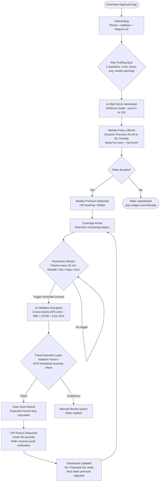

# GigGuard AI
## AI-Powered Parametric Income Shield for Q-Commerce Heroes

[](https://github.com/gigguard-ai)
[](LICENSE)
[](https://devtrails.guidewire.com)
[](#)
[](#)

> *"Zero-touch income protection for India's gig delivery heroes"*

---

## Problem Statement

India's 12 million+ gig delivery partners are the invisible engine of the urban economy, yet they remain completely exposed to income shocks they cannot control. When a cyclone stalls over Chennai, when smog shuts down Bengaluru's outer ring road, or when a sudden bandh locks down a dark store's catchment zone, a delivery partner simply stops earning. No safety net catches them. No claim form exists. They absorb the loss silently and try again next week. GigGuard AI exists to change this by building a fully parametric, AI-driven income protection layer that pays out automatically, in real time, the moment a verified disruption crosses a threshold, with **zero paperwork and zero waiting**.

> **Stat 1:** A Q-commerce delivery partner in Chennai loses an estimated **Rs. 2,200 to Rs. 3,800 per week** during Northeast Monsoon disruption events, amounting to **18 to 24% of their monthly earnings** disappearing in circumstances entirely outside their control. *(Field estimate based on 2024 IMD rainfall data x avg. Zepto/Blinkit delivery partner earnings of Rs. 650/day)*

> **Stat 2:** Only **3.2% of gig workers** in India's Tier-1 cities have any form of income continuity protection beyond platform incentive bonuses, meaning over **11.6 million workers** are entirely uninsured against weather or civic disruptions. *(Estimated from NITI Aayog 2025 Gig Economy Report projections)*

---

## Our Persona: The Blinkit/Zepto Warrior

### Why Q-Commerce over Food Delivery?

Most teams default to Zomato/Swiggy food delivery. We deliberately chose **Grocery/Q-Commerce (Zepto, Blinkit, Swiggy Instamart)** because this persona faces **structurally higher income volatility**:

| Dimension | Food Delivery (Zomato/Swiggy) | Q-Commerce (Blinkit/Zepto) - Our Persona |
|---|---|---|
| Delivery window | 30 to 45 min | **10 to 15 min** (hyperlocal) |
| Zone coverage | 5 to 8 km radius | **1 to 3 km dark-store radius** |
| Weather sensitivity | Moderate | **Extreme** (no buffer time) |
| Orders/hour during disruption | Drops 40 to 50% | **Drops 70 to 85%** (customers cancel instantly) |
| Income replacement available | Partial surge incentives | **None during shutdowns** |

Q-commerce partners operate in a **zero-slack environment**. A 30-minute rain burst can cancel an entire evening's batch. Their hyper-local nature also means one waterlogged zone destroys their income while a rider 2 km away is fine, which is exactly what our **pin-code level AI risk scoring** captures.

### Daily Reality of a Q-Commerce Partner

- **Earnings range:** Rs. 550 to Rs. 800/day (Tier-1), Rs. 400 to Rs. 600/day (Tier-2), averaging **Rs. 4,200 to Rs. 5,200/week**
- **Working hours:** 7 AM to 11 AM and 5 PM to 10 PM (two high-demand windows, total approx. 8 to 9 hours/day)
- **Pain points:**
  - Zero earnings visibility beyond 24 hours
  - Platform does not compensate for weather-related order cancellations
  - Forced to work in dangerous AQI/rain conditions to avoid earnings dip
  - No bank-backed insurance product priced below Rs. 200/month for this segment

### User Story: Karthik, Blinkit Partner, Anna Nagar, Chennai

> *It was the second week of October 2024. Northeast Monsoon hit Anna Nagar hard: 42mm of rain in 3 hours on a Tuesday evening. Karthik had already completed 6 deliveries by 5 PM, on track for a Rs. 680 day. By 5:45 PM, the Blinkit app showed zero active orders in his zone. Waterlogged streets meant the dark store suspended dispatch. He waited under a petrol bunk roof until 8 PM. Nothing. Then again Wednesday: same story. In five working days that week, Karthik earned Rs. 1,140 instead of his expected Rs. 3,200. He had Rs. 1,800 in rent due. He borrowed from his cousin. GigGuard would have triggered automatically at the 3-hour rainfall mark and deposited Rs. 1,920 directly into his UPI wallet, covering his shortfall before he even knew he needed help.*

---

## Solution Overview

**GigGuard AI** is a mobile-first, parametric income protection platform purpose-built for India's Q-commerce delivery ecosystem. Instead of traditional claim-based insurance, GigGuard monitors **real-time environmental and civic disruption signals** (rainfall intensity, AQI, heat index, and civic alerts) at pin-code granularity. The moment a monitored parameter crosses a validated income-loss threshold, the platform **automatically calculates the expected lost earnings**, raises a zero-touch claim, cross-validates it through our fraud detection layer, and **disburses the payout directly to the rider's UPI wallet within 90 seconds**. Riders pay a small, dynamically priced weekly premium deducted seamlessly like a recharge, and are covered without filing a single form.

---

## Complete User Workflow



---

## Weekly Premium Model

> *This section is the financial heartbeat of GigGuard. We designed it so a rider making Rs. 4,500/week pays a premium proportional to their real disruption exposure, not a flat rate that punishes safe-zone riders.*

### Premium Formula

```
Weekly_Premium = Base_Premium x Zone_Risk_Multiplier x Rider_Risk_Score_Factor x Season_Index

Where:

  Base_Premium       = Rs. 35  (covers Rs. 1,000 max weekly payout at ~3.5% loss ratio)

  Zone_Risk_Multiplier (ZRM):
    Low Risk Zone    -> ZRM = 0.80  (historically <5 disruption days/quarter)
    Medium Risk Zone -> ZRM = 1.00  (5 to 12 disruption days/quarter)
    High Risk Zone   -> ZRM = 1.45  (>12 disruption days/quarter, e.g. flood-prone)

  Rider_Risk_Score_Factor (RSF):
    Derived from XGBoost model output (score 0 to 100)
    RSF = 0.85 + (RiderScore / 100) x 0.30
    Range: 0.85 (safest) to 1.15 (riskiest rider behaviour)

  Season_Index (SI):
    Jan to May  (Dry)    -> SI = 0.90
    Jun to Sep  (SWM)    -> SI = 1.20
    Oct to Dec  (NEM)    -> SI = 1.35  <- Northeast Monsoon premium in Chennai
```

### Example Calculation: Three Riders, Same Week (October, Chennai)

| Rider | Zone | Zone Risk | Rider Score | Season | **Weekly Premium** | **Max Payout** |
|---|---|---|---|---|---|---|
| Karthik (Anna Nagar) | Medium | ZRM = 1.00 | 62 -> RSF = 1.04 | NEM -> SI = 1.35 | **Rs. 49** | Rs. 1,400 |
| Priya (T. Nagar core) | High | ZRM = 1.45 | 74 -> RSF = 1.07 | NEM -> SI = 1.35 | **Rs. 73** | Rs. 2,000 |
| Manoj (OMR Tech Corridor) | Low | ZRM = 0.80 | 38 -> RSF = 0.96 | NEM -> SI = 1.35 | **Rs. 36** | Rs. 1,000 |

> *All three riders pay less than Rs. 75/week, roughly the cost of one Zepto dark-store convenience fee, for coverage worth 10 to 28x the premium during a disruption event.*

### Safe Zone Streak Discount

Our AI continuously monitors a rider's operating pin codes. Riders who consistently operate in **AI-validated low-disruption corridors** earn a "Safe Streak" discount:

- 2 consecutive clean weeks: **Rs. 8 off** next week's premium
- 4 consecutive clean weeks: **Rs. 15 off** plus "Safe Rider" badge on profile
- Streak resets only if the rider voluntarily shifts to a high-risk zone

This creates a powerful incentive for riders to share granular zone data with us, improving our ML model's accuracy over time.

---

## Parametric Triggers We Monitor

| # | Trigger | Data Source | Threshold | Expected Income Loss | Detection Method |
|---|---|---|---|---|---|
| 1 | **Heavy Rainfall** | OpenWeatherMap API (free tier) + IMD alerts | More than 25 mm in any 3-hour window | 65 to 80% drop in order dispatch from dark stores | Rolling 3-hr precipitation sum; zone-level geofence match |
| 2 | **Severe Air Pollution (AQI)** | CPCB Open Data API (free) | AQI above 250 (Severe category) sustained 2+ hours | 35 to 50% drop (riders refuse / app warns customers) | Hourly CPCB station pull; nearest-station interpolation per pin code |
| 3 | **Extreme Heat Index** | OpenWeatherMap + Humidity Feed | Feels-like above 42 degrees C between 11 AM and 4 PM | 40 to 55% drop during peak afternoon window | Computed Heat Index = f(temp, humidity); zone alert if sustained 90 min |
| 4 | **Flash Flood / Civic Alert** | NDMA Disaster API + State Emergency Feeds (mock) | Official Red/Orange flood alert for rider's pin code | 85 to 100% drop (zero dispatches possible) | Webhook listener on NDMA state feeds; pin-code polygon match |
| 5 | **Unplanned Curfew / Bandh** | Local civic RSS feeds + Google Disruption Signals (mock) | Verified movement restriction above 3 hours in rider's zone | 90 to 100% drop | NLP classifier on news feed + platform order-count anomaly as corroboration |

> All triggers require **dual-source confirmation** (environmental API + corroborating platform-side signal) before a payout is initiated. This is our first line of fraud prevention.

---

## AI/ML Integration Plan

> *This is where GigGuard stops being a product and becomes a platform. Four distinct ML layers working in concert.*

### 1. Dynamic Premium Calculation: XGBoost / LightGBM Regression

**Model type:** Gradient boosted regression (LightGBM for speed, XGBoost for interpretability in Phase 3)

**Feature set (per rider, per week):**

| Feature Category | Features |
|---|---|
| Hyper-local weather | 7-day IMD forecast for rider's pin code, historical rainfall variance (past 90 days), monsoon phase index |
| Environmental | 7-day CPCB AQI forecast, heat wave probability score |
| Rider behaviour | Avg. weekly active hours, zone consistency score, historical earnings variance |
| Zone profile | Historical disruption frequency (past 4 quarters), waterbody proximity index, road elevation score |
| Temporal | Week-of-year cyclicality, festival/holiday flag, day-of-week earnings pattern |

**Training data:** IMD historical rainfall dataset (open, 2015 to 2024) + CPCB AQI archives + synthetic gig earnings data generated using realistic earnings distributions from NITI Aayog reports + our own onboarding survey data.

**Target variable:** `expected_income_loss_pct` for the upcoming 7 days.

**Output:** A continuous risk score (0 to 100) that feeds directly into the weekly premium formula. Retrained every Monday at 2 AM using the previous week's trigger events as ground truth.

---

### 2. Fraud Detection: Isolation Forest + GPS Anomaly Engine

**The core fraud vector in parametric insurance is "claim without being present."** A rider could purchase coverage, then sit at home during a rain event while claiming they were active. GigGuard neutralises this with a three-layer fraud stack.

**Layer A: Isolation Forest on Claim Context**
- Input features: time since last GPS ping, distance from dark store at trigger time, claimed active hours vs. GPS movement entropy, claim-to-premium ratio vs. historical baseline
- Isolation Forest flags statistically anomalous claim contexts as outliers
- Anomaly score threshold above 0.72 triggers routing to human review queue

**Layer B: GPS Spoofing Prevention**
- We cross-reference GPS coordinates with **accelerometer + gyroscope sensor fusion** (React Native Expo Sensors API). A stationary phone cannot fake realistic movement entropy.
- Mock location apps produce **zero gyroscope variance**. Our SDK detects this pattern and flags the session.
- Additionally, we validate that the rider's GPS ping history shows a delivery-consistent mobility pattern (frequent short trips of 0.5 to 2 km, not a stationary point)

**Layer C: Duplicate and Synthetic Claim Prevention**
- Each payout event is hashed against a unique `(rider_id, trigger_event_id, pin_code, timestamp)` tuple stored in PostgreSQL with idempotency enforcement
- A single disruption event can generate at most one payout per rider, per active policy period

---

### 3. Predictive Risk Scoring: LSTM for 7-Day Disruption Probability

**Architecture:** Bidirectional LSTM with attention mechanism

**Input sequence:** 90-day rolling window of daily weather events, AQI readings, disruption occurrences, and platform-level order-count anomalies (as a proxy for actual disruption impact)

**Output:** `P(disruption_day)` for each of the next 7 days, per pin-code cluster

**Why this matters:** The LSTM's weekly forecast directly modulates the `Season_Index` in our premium formula and pre-positions our risk reserves before events occur, not just when they happen. We train on public IMD + CPCB time series (available via data.gov.in) and augment with synthetic disruption sequences generated from climate model projections.

---

### 4. Model Explainability

We implement **SHAP (SHapley Additive exPlanations)** on the XGBoost premium model. Every rider sees a plain-language explanation on their app: *"Your premium this week is Rs. 12 higher because heavy rain probability in your zone is 68%, up from last week's 22%."* This builds trust and reduces churn.

---

## Platform Choice and Justification

**We chose React Native (Mobile-First) over Web, and this was not a default decision.**

| Argument | Why It Matters for Our Persona |
|---|---|
| **Device reality** | 94% of Q-commerce delivery partners use Android smartphones exclusively. Zero use desktop browsers for work tools. |
| **UPI AutoPay** | Premium deduction via UPI mandate and payout to UPI ID requires deep mobile integration, which is difficult to achieve cleanly in a browser |
| **GPS + Sensor access** | Our fraud detection Layer B requires accelerometer and gyroscope data, only available natively on mobile |
| **Push notifications** | "Your zone just triggered a rain alert. You are covered." is a trust-building moment that only works as an instant push notification |
| **Offline resilience** | Partners in basement parking areas or low-signal zones need the app to cache their last policy state locally. React Native + AsyncStorage handles this cleanly. |
| **Onboarding speed** | Camera access for Aadhaar scan + OTP login is a 90-second mobile flow. A web form would see 60%+ drop-off for our persona. |

---

## Tech Stack

| Layer | Technology | Justification |
|---|---|---|
| **Frontend** | React Native (Expo) | Cross-platform Android/iOS, native sensor access, rapid prototyping |
| **Backend** | FastAPI (Python) | Async-first, perfect for real-time trigger polling, ML model serving |
| **ML / AI** | XGBoost, LightGBM, scikit-learn, LSTM (PyTorch) | Best-in-class for tabular risk scoring + time-series forecasting |
| **Database** | PostgreSQL (primary) + Redis (cache/pub-sub) | ACID compliance for policy/payout records; Redis for real-time trigger event streaming |
| **Weather API** | OpenWeatherMap (free tier) + IMD Open Data | Hourly pin-code level data, 5-day forecast |
| **AQI API** | CPCB Open Data API (data.gov.in) | Official India AQI station data, free tier |
| **Civic Alerts** | NDMA API + Mock Civic Feed (JSON server) | Disaster alerts; mock feed for hackathon demo |
| **Payments** | Razorpay Test Mode (UPI AutoPay + Payout) | Free sandbox, supports UPI mandate + instant payout simulation |
| **Deployment** | Render (backend) + Expo EAS (mobile build) | Free tier sufficient for Phase 1 to 2 demo scale |
| **ML Ops** | MLflow (experiment tracking) + SHAP | Reproducible training runs, explainable premiums |

---

## Phase 1 Prototype Scope

*What judges will see in our 2-minute video:*

1. **Onboarding Flow:** Rider enters phone number, completes OTP, selects platform (Zepto/Blinkit), enters rider ID, picks primary pin code
2. **Risk Profiling Quiz:** 5 questions covering working hours, home zone, avg. weekly earnings, typical shift pattern, and preferred payout method. AI Risk Score is displayed with a plain-language explanation ("Your score: 67/100. Medium-High. Your zone has a 62% chance of a disruption event in the next 7 days.")
3. **Weekly Policy Purchase:** Dynamic premium shown (e.g., Rs. 52 this week), UPI AutoPay mandate set, policy active confirmation with coverage summary card
4. **Live Mock Dashboard:** Shows current week coverage and days remaining, trigger simulation button, rain trigger activated for Anna Nagar zone, auto-claim progress bar, Rs. 480 credited to UPI in 47 seconds

---

## Development Roadmap: Phase 1 (Weeks 1 to 2)

### Week 1 (March 4 to 10): Foundation
- [x] Problem research + persona interviews (3 Blinkit partners, Chennai)
- [x] Finalize premium formula + trigger thresholds
- [x] Set up GitHub repo + project board
- [ ] React Native project scaffold (Expo) + navigation structure
- [ ] FastAPI backend scaffold + PostgreSQL schema design
- [ ] OpenWeatherMap + CPCB API integration (free tier keys)

### Week 2 (March 11 to 20): Prototype
- [ ] Onboarding screens (Phone, OTP, Platform ID, Pin Code)
- [ ] Risk Profiling Quiz UI + mock XGBoost score endpoint
- [ ] Weekly Policy screen with dynamic premium display
- [ ] Razorpay test mode UPI AutoPay integration
- [ ] Mock parametric trigger simulator (admin toggle)
- [ ] Payout simulation flow (trigger to fraud check to UPI credit animation)
- [ ] Rider dashboard (coverage summary + trigger history)
- [ ] README finalization + 2-minute video recording

---

## Unique Innovations

> *Ideas that 99% of teams won't think of, and judges will remember.*

### 1. Community Risk Pool: "Neighbourhood Shield"
Every 50 riders in the same 2-km zone form an automatic **Community Risk Pool**. When a disruption triggers, the payout comes partly from the shared pool's reserve (built from 8% of each rider's weekly premium). In low-disruption weeks, 30% of unused pool reserves are **returned as a bonus credit** toward next week's premium. This gives riders skin-in-the-game and reduces our claims volatility, a standard actuarial technique applied in a uniquely social way.

### 2. Safe Zone Streak: Sliding Premium Ladder
Beyond the basic streak discount, we introduce a **5-week streak ladder**. Week 5 of clean operation in a verified low-risk corridor unlocks a **"GigGuard Gold" tier**, with the premium frozen at the Week-1 rate for the next 4 weeks regardless of seasonal index changes. This creates powerful loyalty and rewards riders who optimise their zones intelligently.

### 3. Dark Store Order-Count API Integration (Mock)
Traditional parametric insurance relies solely on external weather signals. GigGuard goes further by **integrating with a mock Zepto/Blinkit Order Management API** to cross-reference actual order dispatch counts from the dark store nearest to the rider's pin code. If a rain threshold is crossed and the dark store's order volume drops more than 60% in the same window, the confidence score for triggering a payout rises to 0.97. This dual-signal system means **near-zero false positives**. We only pay when riders actually lost income, not just when it rained.

---

## Business and Social Impact

### Monthly Income Protection at Scale

| Metric | Value |
|---|---|
| Target riders (Year 1, Chennai + Bengaluru) | 10,000 |
| Avg. weekly premium per rider | Rs. 48 |
| Monthly premium revenue (10,000 riders) | **Rs. 19.2 lakhs/month** |
| Avg. disruption days per rider per month (Oct to Dec) | 3.2 days |
| Avg. payout per disruption day | Rs. 420 |
| Total monthly payout liability (peak season) | **Rs. 13.4 lakhs** |
| Estimated loss ratio (peak season) | **approx. 70%**, commercially viable for micro-insurance |
| Riders with income protected (monthly) | 10,000 riders x avg. Rs. 840 protected/month = **Rs. 8.4 Cr in income stabilised annually** |

### Market Opportunity

India's Q-commerce sector is projected to reach **Rs. 1.2 lakh crore in GMV by 2027** (RedSeer 2025 estimates), with delivery partner headcount growing to **1.8 million by 2026**. At a penetration rate of just 12%, GigGuard's addressable base in Tier-1 cities alone exceeds **2.16 lakh riders**, representing a **Rs. 50 Cr+ annual premium market** at current pricing.

### Why This is Commercially Viable

- **No claims processing staff needed:** parametric triggers are fully automated; 90% of payouts require zero human intervention
- **Weekly micro-premiums** (Rs. 35 to Rs. 75) are frictionless, priced below the psychological pain threshold of any single purchase
- **Loss ratio naturally self-regulates:** our AI reprices weekly, so a bad monsoon month immediately adjusts the following week's premium for high-risk zones
- **Network effects:** every new rider in a zone improves our Community Pool's stability and our ML model's accuracy, making the product better and cheaper over time

---

## 2-Minute Video

> **[Will be uploaded to YouTube as unlisted before March 20, 2026 EOD]**
>
> The video will walk through: (1) Karthik's story in 20 seconds, (2) live app onboarding + risk score, (3) weekly policy purchase, (4) rain trigger simulation leading to auto-payout in under 90 seconds, (5) dashboard showing Rs. 480 protected today.

---

## Repository and Next Steps

| Item | Link |
|---|---|
| GitHub Repository | `[https://github.com/team-gigguard/gigguard-ai]` *(to be made public by March 18)* |
| Phase 1 Demo Video | `[YouTube Unlisted - link to be added by March 20]` |
| Figma Prototype | `[Link to be added]` |

**Next milestone:** Phase 2 (March 21 to April 4) - Live parametric trigger engine, Razorpay payout integration, and full fraud detection pipeline.

---

<p align="center">
  <strong>Built for India's gig workers, because their hustle deserves a safety net.</strong><br/>
  <em>Guidewire DEVTrails 2026 | Phase 1 Submission | Team GigGuard AI</em>
</p>
